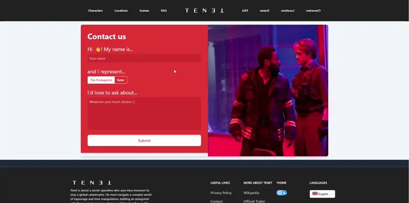
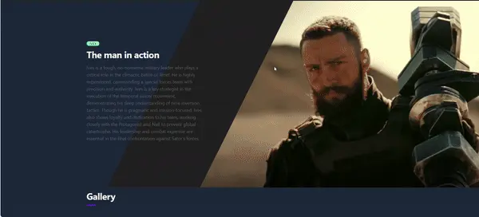

# TENET : a Jahia CMS NPM implementation over 8.2.0 #

This is a demo for new Jahia Javascript Modules.

Below is a list of showcases of the use of external Js library for effect (instead of the usual Jahia JSP usecase)
 

To run the latest demo case :

 ***docker run -p 9000:8080 achaabni/jahia-tenet:latest***

Then open in your browser  ***localhost:9000/***

For administration and editing content default Login:password are `root:root1234`

| Aspect                     | Solution                                  |
| -------------------------- | ----------------------------------------- |
| 🛠️ Frameworks, Libraries   | [React], [Webpack]                        |
| 🛠️ CMS                     | [Jahia]                                   |
| 🐚 Application Shell       | [Webpack] [Jahia Appshell]                |
| 🧩 Client-Side Integration | [Module Federation]                       |
| 🧩 Server-Side Integration | Jahia CMS                                 |
| 🎨 Styling                 | Tailwind CSS (A lot of copy paste )       |
| 👩‍💻 Local Development       | [Webpack]                                 |

***Extra NPM packages used to make this demo :***

| ***Package***               | ***Use***                                |
| -------------------------- | ----------------------------------------- |
| react-cookie               | Saving and reading cookies                |
| framer-motion              | Motion and Client Side effects            |
| @headlessui/react          | Dynamic Headless React components         |
| @heroicons/react           | Icons                                     |
| country-flag-icons         | Getting Countries Flags + Language default|
| tailwindcss                | CSS styling and design, automatic js      |
| truncate-html              | Truncating long text for smaller components|

Enjoy the demo and the followup on TENET story.
